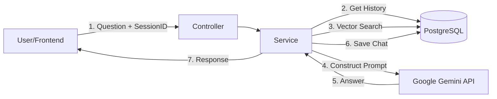

# NexusAI 🤖

### The Hybrid RAG Chatbot Platform

**NexusAI** is a modular, high-performance RAG (Retrieval-Augmented Generation) platform designed for building specialized AI agents instantly.

Unlike standard chatbots, NexusAI gives you full control. A **single user** can create and manage **multiple distinct bots** (e.g., a "Sales Bot," a "Support Bot," and a "Booking Bot"), each with its own brain and data.

### 🌟 Key Capabilities

* **Multi-Source Knowledge:** Train your bots by uploading **PDF documents** or simply pasting **Website URLs** (Crawler integration).
* **Deep Customization:** Configure each bot's personality (`system_instruction`) and choose the specific AI model that fits your needs (e.g., `Gemini Pro` for reasoning, `Flash` for speed).
* **Hybrid Architecture:** Combines the privacy of **local vector search** with the power of **Cloud LLMs** for cost-effective, high-accuracy responses.

---

## 🚀 Current Status: Phase 01 Completed

**Focus:** Core RAG Engine & Intelligent Retrieval

We have successfully built the "Engine Room" of the application. The system can now ingest documents, understand context, maintain conversation history, and generate accurate, personality-driven responses.

### ✅ Key Features Implemented

* **Hybrid RAG Architecture:**
* **Retrieval (Local):** Uses **Ollama** (embeddings) and **PostgreSQL `pgvector**` for private, zero-cost semantic search.
* **Generation (Cloud):** Connects to **Google Gemini** for high-quality, human-like reasoning.

* **Advanced Ingestion Pipeline:**
* Uses **Apache Tika** for robust PDF text extraction.
* Implements **Sliding Window Chunking** (Smart Sentence-Aware) to preserve context across paragraph breaks (solved critical context loss issues).

* **Session-Based Memory:**
* Supports multiple concurrent users via `visitor_session_id`.
* Chatbots remember conversation history (Sliding window of last 10 turns) to handle follow-up questions.

* **Single User, Multiple Bots:**
* Architecture supports one admin managing diverse bots (Info Bot, Appointment Bot, etc.) from a single dashboard.

---

## 🛠 Architecture

The system follows a clean Controller-Service-Repository pattern:

---

## 💻 Tech Stack

* **Backend:** Java 17+, Spring Boot 3.x
* **Database:** PostgreSQL 15+ (with `pgvector` extension)
* **AI (Embeddings):** Ollama (running `nomic-embed-text` locally)
* **AI (Chat):** Google Gemini API (`gemini-1.5-flash`)
* **Utils:** Apache Tika (PDF Parsing), Lombok, Docker

---

## 🗺 Roadmap

We are building a full SaaS platform. Here is the plan:

### 🟢 Phase 01: The Core Engine (Completed)

* [x] PDF Ingestion & Vectorization
* [x] Semantic Search via `pgvector`
* [x] Integration with Google Gemini
* [x] Conversation Memory (Session handling)
* [x] Personality Injection & Custom System Instructions

### 🟡 Phase 02: The Frontend Experience (In Progress)

* [ ] **Tech:** React.js / Next.js + Tailwind CSS.
* [ ] **Chat Widget:** A polished, embeddable chat bubble for client websites.
* [ ] **Dashboard:** Admin UI to create bots, upload PDFs, and manage API keys.
* [ ] **Streaming:** Real-time typewriter effect for AI responses.

### 🔴 Phase 03: Specialized Agents & Expansion

* [ ] **Transactional Bots:**
* **Payment Bot:** Integration with Stripe/PayPal to handle secure checkout links inside the chat.
* **Booking Bot:** Integration with Calendly/Google Calendar for real-time appointment scheduling.

* [ ] **Multi-Language Support:** Auto-detection of user language (e.g., User speaks Spanish -> Bot replies in Spanish) without re-training data.
* [ ] **Web Crawler:** Ability to scrape live URLs to keep knowledge bases up-to-date automatically.
* [ ] **Model Switcher:** UI toggle to swap between Gemini 1.5, GPT-4, or Local Llama 3 per bot.

### 🔴 Phase 04: Production & Scale

* [ ] **Multi-Tenancy:** Data isolation for different enterprise clients.
* [ ] **Rate Limiting:** Protect API from abuse (Redis).
* [ ] **Analytics:** Dashboard for "Most Common Questions" and "Bot Sentiment."

---
## 🖥 Some UI Interfaces 

Contributions are welcome! Please fork the repository and create a Pull Request for any features in the **Phase 02** bucket.

**License:** MIT
